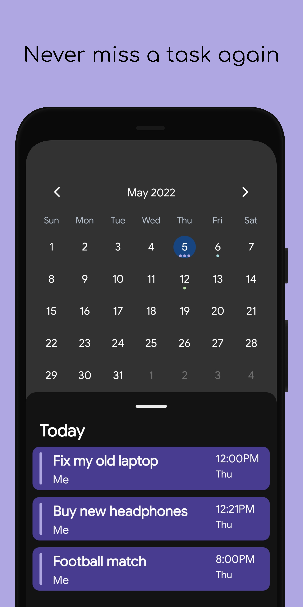

<div id="top"></div>

<!--
*** Thanks for checking out the Best-README-Template. If you have a suggestion
*** that would make this better, please fork the repo and create a pull request
*** or simply open an issue with the tag "enhancement".
*** Don't forget to give the project a star!
*** Thanks again! Now go create something AMAZING! :D
-->

<!-- PROJECT SHIELDS -->
<!--
*** I'm using markdown "reference style" links for readability.
*** Reference links are enclosed in brackets [ ] instead of parentheses ( ).
*** See the bottom of this document for the declaration of the reference variables
*** for contributors-url, forks-url, etc. This is an optional, concise syntax you may use.
*** https://www.markdownguide.org/basic-syntax/#reference-style-links
-->

[![Contributors][contributors-shield]][contributors-url]
[![Forks][forks-shield]][forks-url]
[![Stargazers][stars-shield]][stars-url]
[![Issues][issues-shield]][issues-url]
[![MIT License][license-shield]][license-url]
[![LinkedIn][linkedin-shield]][linkedin-url]

<!-- PROJECT LOGO -->
<br />
<div align="center">
  <a href="https://github.com/iskaa02/taskkit">
    
  </a>

<h3 align="center">Taskkit</h3>

  <p align="center">
    Task management tool written in react native
    <br />
    <a href="https://github.com/iskaa02/taskkit/issues">Report Bug</a>
    ·
    <a href="https://github.com/iskaa02/taskkit/issues">Request Feature</a>
  </p>
</div>

<!-- TABLE OF CONTENTS -->
<details>
  <summary>Table of Contents</summary>
  <ol>
    <li><a href="#screenshots">Screenshots</a></li>
    <li><a href="#built-with">Built With</a></li>
    <li><a href="#installation">Installation</a></li>
    <li><a href="#roadmap">Roadmap</a></li>
    <li><a href="#contributing">Contributing</a></li>
    <li><a href="#license">License</a></li>
    <li><a href="#contact">Contact</a></li>
  </ol>
</details>

<!-- ABOUT THE PROJECT -->

## Screenshots

<div style="display:flex;justify-content:space-between">



</div>
                                            
<p align="right">(<a href="#top">back to top</a>)</p>

### Built With

- [React.js](https://reactjs.org/)
- [React native](https://reactnative.dev/)
- [Expo](https://expo.dev/)
- [WatermelonDB](https://github.com/Nozbe/WatermelonDB)

<p align="right">(<a href="#top">back to top</a>)</p>

<!-- GETTING STARTED -->

### Installation

1. Make an [expo account](https://expo.dev/)
2. Clone the repo
   ```sh
   git clone https://github.com/iskaa02/taskkit.git
   ```
3. Install packages

   ```sh
   yarn
   ```

4. Build project with expo EAS

   for development change the --profile argument to development

   to build for ios change the -p argument to ios

   ```sh
   eas build -p android --profile production
   ```

   <p align="right">(<a href="#top">back to top</a>)</p>

<!-- ROADMAP -->

## Roadmap

- Building a Sever
  - Sync between devices
  - Share lists between users

See the [open issues](https://github.com/iskaa02/taskkit/issues) for a full list of proposed features (and known issues).

<p align="right">(<a href="#top">back to top</a>)</p>

<!-- CONTRIBUTING -->

## Contributing

Contributions are what make the open source community such an amazing place to learn, inspire, and create. Any contributions you make are **greatly appreciated**.

If you have a suggestion that would make this better, please fork the repo and create a pull request. You can also simply open an issue with the tag "enhancement".
Don't forget to give the project a star! Thanks again!

1. Fork the Project
2. Build Development client with EAS `sh eas build -p [platform] --profile development`
3. Create your Feature Branch (`git checkout -b feature/AmazingFeature`)
4. Commit your Changes (`git commit -m 'Add some AmazingFeature'`)
5. Push to the Branch (`git push origin feature/AmazingFeature`)
6. Open a Pull Request

<br/>

### Translations

To translate the app to your own language

1. follow the [Contribution](#contributing) steps
2. add [your language code].json file into [src/i18n folder](https://github.com/iskaa02/Taskkit/tree/main/src/i18n)
3. translate all keys check the [en.json](https://github.com/iskaa02/Taskkit/blob/main/src/i18n/en.json) file for reference
4. add you language config [in this file](https://github.com/iskaa02/Taskkit/blob/main/src/i18n/langs.ts#L8)

<p align="right">(<a href="#top">back to top</a>)</p>

<!-- LICENSE -->

## License

Distributed under the MIT License. See `LICENSE` for more information.

<p align="right">(<a href="#top">back to top</a>)</p>

<!-- CONTACT -->

## Contact

Ismael Karim - ismael.karim000@gmail.com

Project Link: [https://github.com/iskaa02/taskkit](https://github.com/iskaa02/taskkit)

<p align="right">(<a href="#top">back to top</a>)</p>

<!-- MARKDOWN LINKS & IMAGES -->
<!-- https://www.markdownguide.org/basic-syntax/#reference-style-links -->

[contributors-shield]: https://img.shields.io/github/contributors/iskaa02/taskkit.svg?style=for-the-badge
[contributors-url]: https://github.com/iskaa02/taskkit/graphs/contributors
[forks-shield]: https://img.shields.io/github/forks/iskaa02/taskkit.svg?style=for-the-badge
[forks-url]: https://github.com/iskaa02/taskkit/network/members
[stars-shield]: https://img.shields.io/github/stars/iskaa02/taskkit.svg?style=for-the-badge
[stars-url]: https://github.com/iskaa02/taskkit/stargazers
[issues-shield]: https://img.shields.io/github/issues/iskaa02/taskkit.svg?style=for-the-badge
[issues-url]: https://github.com/iskaa02/taskkit/issues
[license-shield]: https://img.shields.io/github/license/iskaa02/taskkit.svg?style=for-the-badge
[license-url]: https://github.com/iskaa02/taskkit/blob/master/LICENSE
[linkedin-shield]: https://img.shields.io/badge/-LinkedIn-black.svg?style=for-the-badge&logo=linkedin&colorB=555
[linkedin-url]: https://linkedin.com/in/ismael-karim-226887214/
